<div align="center">

# Nestworth

**Your whole household, one clear number.**

A local-first personal-finance app for Windows, Android and iOS. Your accounts,
transactions, investments, loans and property in one place — and every figure stays on
your own device. No account to create, no server that holds your data.

</div>

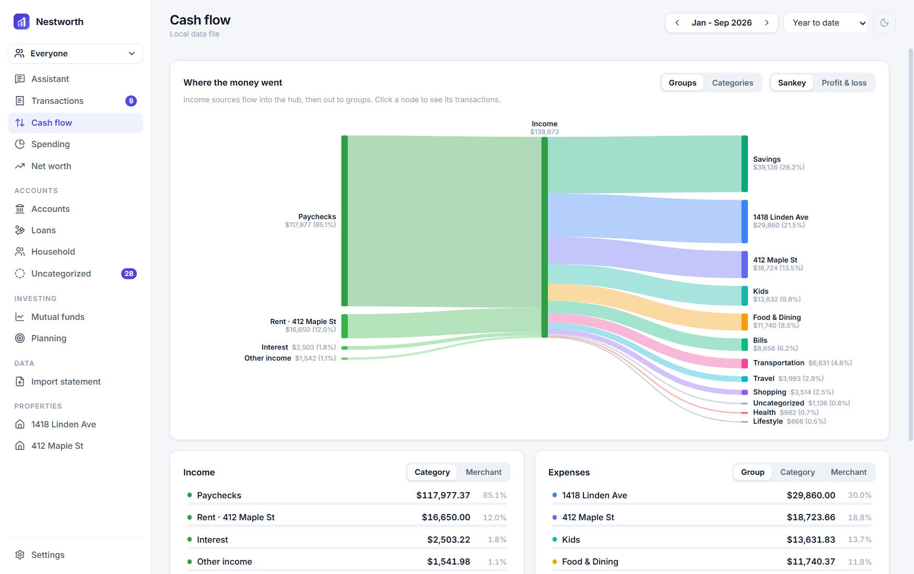

> Not affiliated with any commercial finance product. Nothing here is financial advice.

---

## Contents

- [Install](#install) · [Upgrades keep your data](#upgrades-keep-your-data)
- [A closer look](#a-closer-look) — screenshots
- [Features in detail](#features-in-detail)
- [Privacy &amp; security](#privacy--security)
- [Build from source](#build-from-source)
- [Docs](#docs)

---

## Install

Grab the latest build from the [**Releases**](../../releases) page:

| Platform | File | Notes |
| --- | --- | --- |
| **Windows** | `Nestworth Setup <version>.exe` | Download and run the installer. |
| **Android** | `Nestworth-<version>.apk` | Allow installs from your browser, then open the file. |
| **iOS** | build from source | No App Store build; see [below](#build-from-source). |

Inside the app, **Settings → Updates** checks this repository for newer releases and links
you straight to the download. It only ever asks GitHub for the latest release number;
none of your financial data leaves the device, and the check is off until you enable it.

### Upgrades keep your data

Your data lives in your operating system's user profile, **not** inside the installed
program, so installing a new version over an old one keeps every account, transaction and
setting. To move to another machine, use **Settings → Your data → Download all my data**
and restore the file on the other device — the same file also moves data between desktop
and mobile. Details in [RELEASING.md](RELEASING.md).

---

## A closer look

|  |  |
| --- | --- |
| **Transactions** — search, group and filter, with inline categories and tags. | **Spending** — where it goes, by category and merchant. |
| 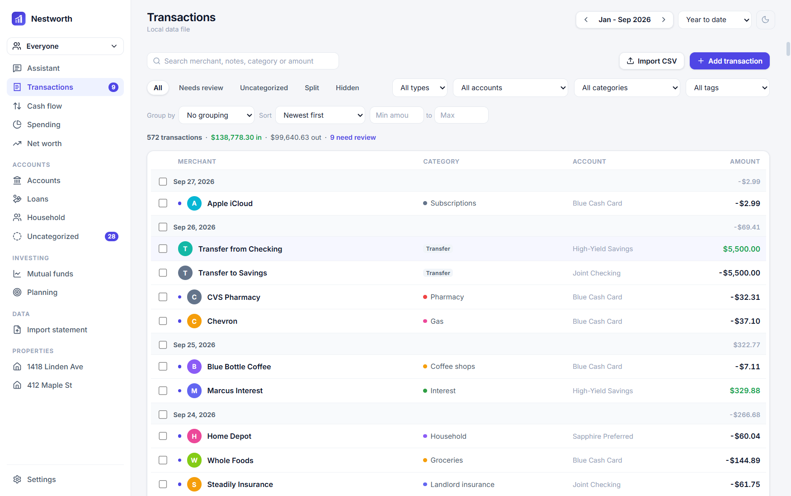 | 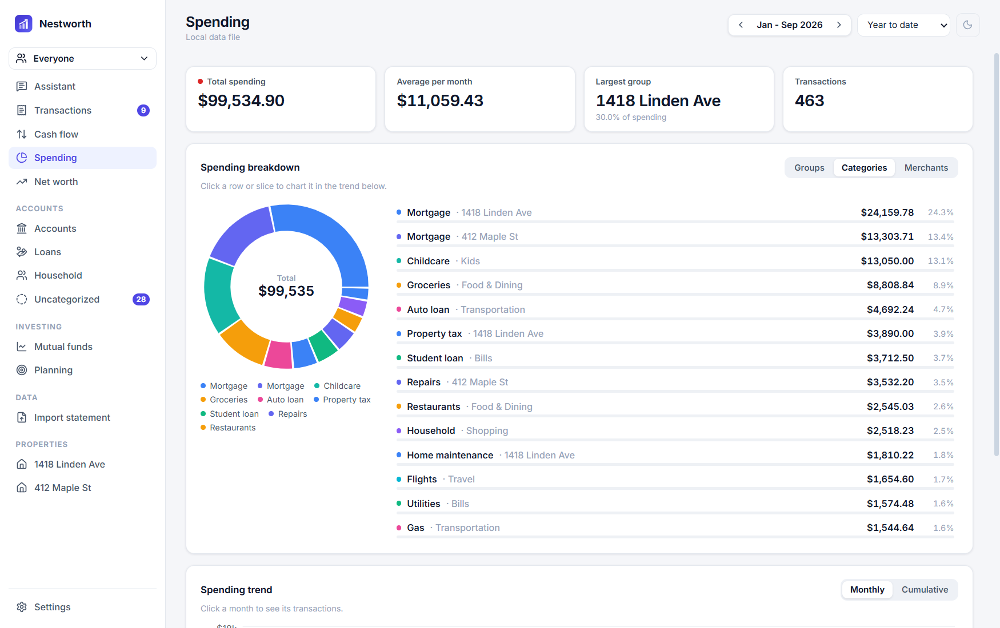 |
| **Net worth** — assets and liabilities over time. | **Accounts** — everything you hold, in its own currency. |
| 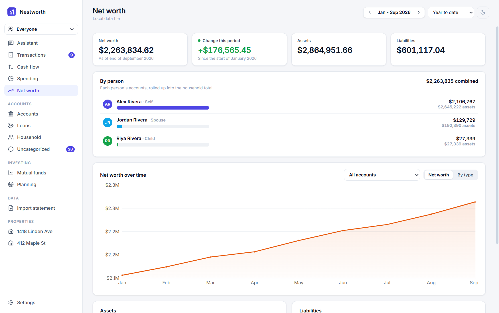 | 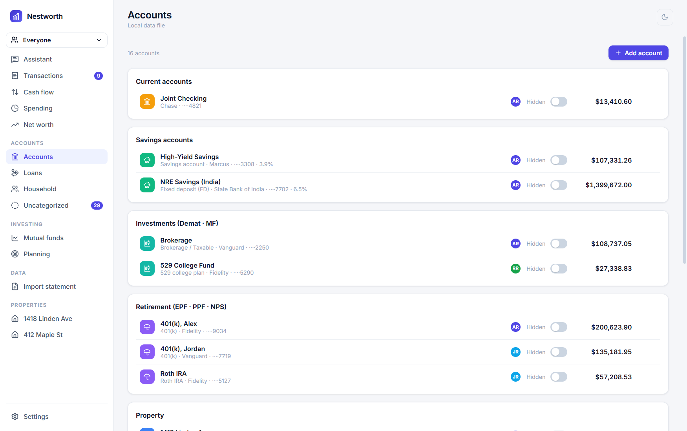 |
| **Household** — each person's accounts, rolled up together. | **Planning** — goals, macro backdrop, and a FIRE projection. |
| 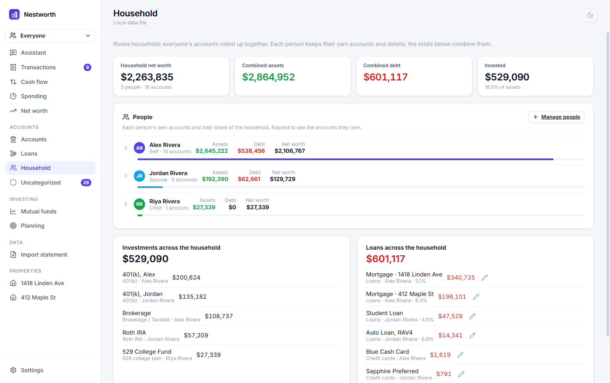 | 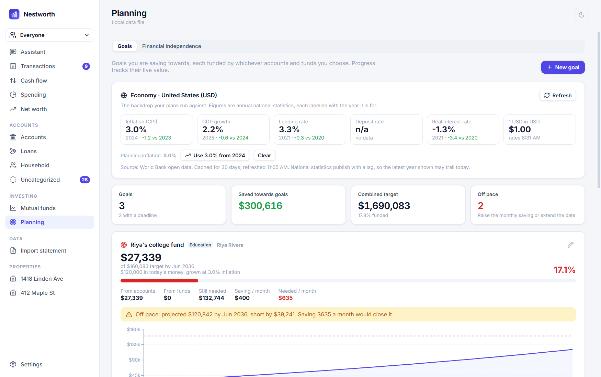 |
| **Property** — appreciation, yield and equity as an investment. | **Mutual funds** — explore, track and check overlap. |
| 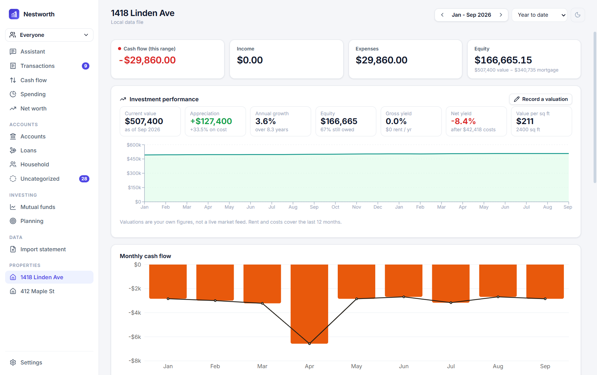 | 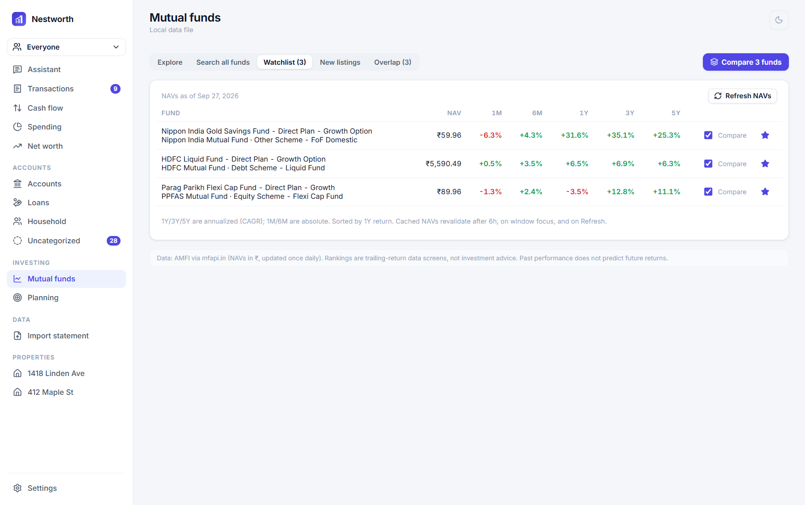 |
| **Import** — statements from files or email, on-device. | **Settings** — one place for currency, people, AI and data. |
| 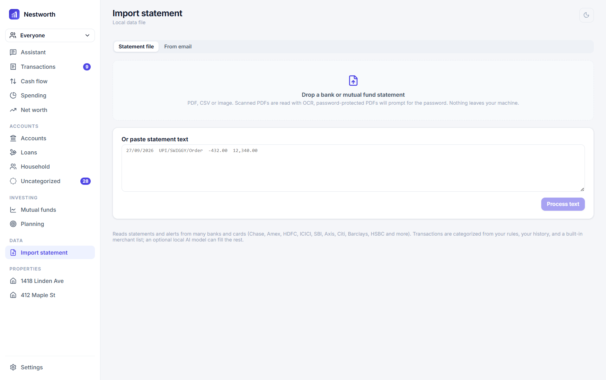 | 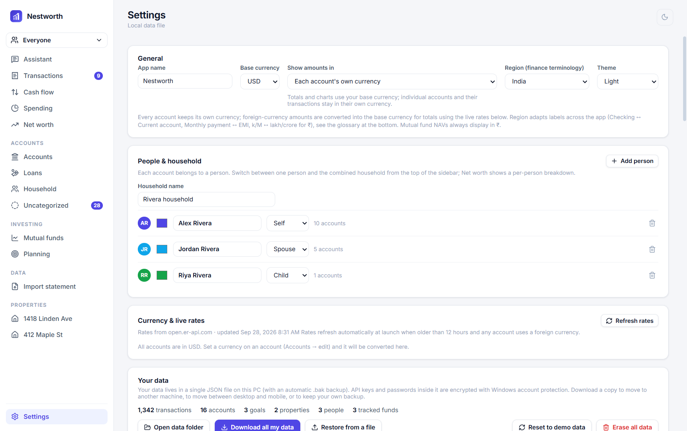 |

The built-in **Assistant** answers questions about your own numbers using an AI model you
bring and store locally:

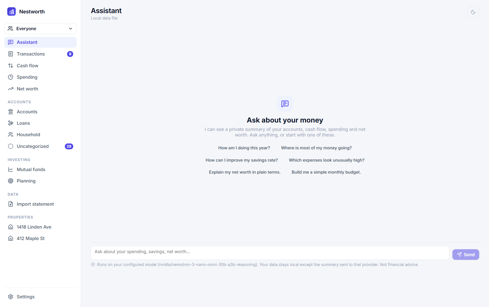

---

## Features in detail

### Everyday money

- **Transactions** with full-text search, group-by (date, category, merchant, account,
  tag, owner, review status), amount and type filters, split transactions, tags, and
  bulk edits.
- **Cash flow** as an interactive Sankey — income sources flow into a hub and back out to
  spending groups — plus a profit-and-loss view. Every node shows its amount and share.
- **Spending** broken down by category and merchant with trends over any date range.
- **Net worth** over time, with assets and liabilities grouped by type, and a per-person
  breakdown.
- **Accounts and loans** for every vehicle: checking, savings, cash, cards, brokerage,
  retirement, real estate and loans. Loans track rate, EMI/payment, original principal
  and payoff progress. Edit or remove anything in place.

### Households and people

- Multiple people, each owning their own accounts with their own details.
- A **Household** view that rolls everyone up into one net worth, with each person's share
  and expandable account lists, plus combined investments and loans attributed by owner.

### Bringing data in

- **Statement import** from PDF, CSV, or image. Scanned PDFs are read with **on-device
  OCR** — no cloud. Password-protected statement PDFs are supported.
- **Import from email**, the way CRED reads card statements: drop an `.eml`, paste an
  email, or connect an inbox over IMAP (desktop). Bank and card senders are recognised,
  and password-protected attachments are opened with saved passwords.
- **Always-on de-duplication** that is fuzzy across dates, so re-importing an overlapping
  period — or a statement a family member already added — never doubles anything up.
- Optional **AI categorization** fills only the rows the built-in engine is unsure about,
  using a model you configure.

### Investing

- **Mutual-fund explorer** over live AMFI data: search every scheme, see NAV history and
  trailing returns, keep a watchlist, and screen top performers by category.
- **Fund-overlap checker** — pick funds and see, as a matrix and ranked pairs, how much
  they likely hold in common, with an optional AI read and grounded alternatives.
- **Insurance as an investment** vehicle (ULIP, endowment, whole/universal life,
  annuities and more) alongside conventional accounts.

### Planning

- **Goals** funded by any mix of accounts and specific funds, with live progress, the
  monthly contribution actually required, an inflation-adjusted target option, and a
  projection chart with an honest on-pace / off-pace verdict.
- A **FIRE** projection in real terms, showing the nominal return it implies at current
  inflation.
- A **macro backdrop** — inflation, GDP growth and interest rates for your currency's
  economy, from World Bank open data, adoptable into your planning assumptions with one
  click.

### Property

- Record a valuation, compute one from a **local rate per unit area** (circle/guidance
  rate), or get an **AI estimate** — then track appreciation, annualised growth (CAGR),
  equity and loan-to-value, and gross/net rental yield.

### Money that travels

- **Multi-currency** with live exchange rates, per-account currencies, and a "show
  everything in my base currency" mode so the whole app reads in one currency.
- 66 base currencies, with native symbols and grouping (₹ lakh/crore, and so on).

### The assistant

- A conversational assistant grounded in a private summary of your finances, plus
  AI-assisted statement categorization and fund analysis. All of it uses an API key you
  bring and store locally, across any major provider (OpenAI, Anthropic, Google, NVIDIA,
  or a fully local Ollama/LM Studio server). Nothing is required; the app is fully usable
  offline.

---

## Privacy &amp; security

- Data is stored on-device in a single JSON file. On desktop, API keys and passwords in
  it are encrypted with the OS keychain; exported backups exclude secrets by default.
- The packaged desktop app runs **sandboxed**, over a private `app://` scheme, with a
  strict **Content-Security-Policy**, no Node in the renderer, navigation locked to the
  app, and every Chromium permission prompt denied.
- **OCR runs entirely on-device.** The only network calls are to services you choose:
  mutual-fund / FX / macro data, the GitHub release check, and your own AI provider.
- Android builds set `allowBackup="false"` so finance data cannot leave via system backup.

---

## Build from source

Requires Node.js 20+. For Android you also need the Android SDK and JDK 21; for iOS, a
Mac with Xcode.

```bash
cd app
npm install

# Desktop (Electron), development
npm run dev

# Windows installer  ->  app/release/
npm run dist

# Android APK
npm run build && npx cap sync android
cd android && ./gradlew assembleDebug   # app/android/app/build/outputs/apk/debug/
```

Handy scripts: `npm run typecheck`, `npm run build`, `npm run smoke:electron` (boots the
packaged app and asserts it renders), `npm run screenshots` (regenerates the images
above).

---

## Docs

- [PRD.md](PRD.md) — product requirements, feature by feature.
- [CONTEXT.md](CONTEXT.md) — engineering context and hard-won gotchas.
- [RELEASING.md](RELEASING.md) — how to cut a release and why upgrades keep user data.
- [BRANDING.md](BRANDING.md) · [MOBILE.md](MOBILE.md)

## License

No license has been chosen yet, so all rights are reserved by the author. Add a `LICENSE`
file to permit reuse.

<div align="center"><sub>Screenshots use built-in demo data (the fictional "Rivera household").</sub></div>
